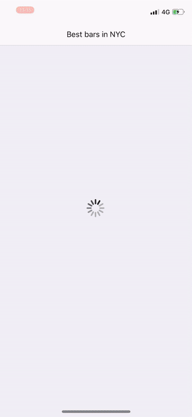

# Best New York City bars

Code example.

## Content

### Video

* [Requirements](#requirements)
* [Install dependencies](#install)
* [Architecture](#architecture)

##  Requirements

* XCode 10.0+
* Swift 4.0+
* iOS 12.4+
* [CocoaPods](https://guides.cocoapods.org/using/using-cocoapods.html) 1.7.1+

##  Install dependencies

1. Install pod:

		$ pod install

##  Architecture

The app was developed using [Clean swift](https://clean-swift.com/), which is based on [Clean Architecture](https://blog.cleancoder.com/uncle-bob/2012/08/13/the-clean-architecture.html).

It uses a unidirectional VIP cycle.

